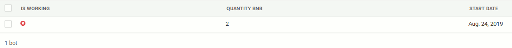
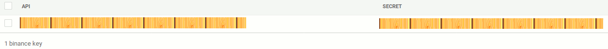
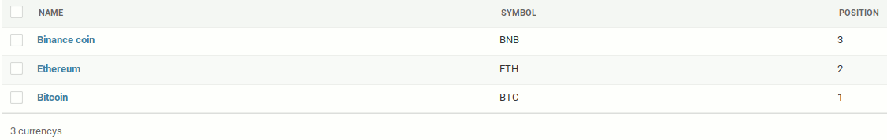
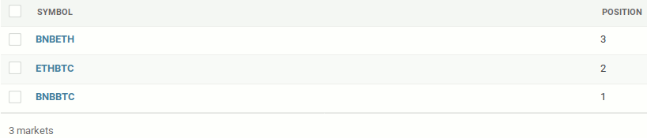
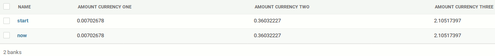
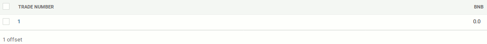
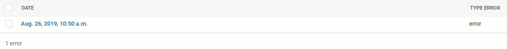
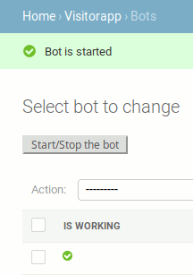
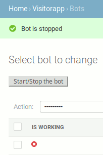

# DJANGO TRADING BOT
A bot trader with a Django interface for the [Binance](https://www.binance.com/en)'s markets. It's intended to work with cryptocurrencies [Bitcoin(BTC)](https://en.wikipedia.org/wiki/Bitcoin), [Ethereum(Eth)](https://en.wikipedia.org/wiki/Ethereum) and [Binance coin(BNB)](https://www.investopedia.com/terms/b/binance-coin-bnb.asp), the latter allowing to benefit a 25% discount on [the transaction fees applied by Binance](https://www.binance.com/en/fee/schedule). If you want to use it with others, you’ll have to adapt the code...  
Completely ignoring fluctuations in the BTC/$, ETH/$ and BNB/$ markets, it's more a miner than a trader with the aim of generating BTC, ETH and BNB. So ***PAY ATTENTION*** to its use if you want to get rich with profits in $.  
Finally, you need a binance account with a minimum balance of 1.05 BNB and the equivalent in BTC and ETH.
> For example, if the price on BNB/BTC market is 0.0026057 and 0.138650 on BNB/ETH market  
> you must have at least 0.00278985 BTC, 0.1455825 ETH and 1.05 BNB
## TRADING STRATEGY
To be clear, ***I am not a trader*** and the following strategy may seem to simple, or even inapropriate. So, feel free to improve it and let me know if you do.  
The bot sends a request to the [binance-api](https://github.com/binance-exchange/binance-official-api-docs) to recover the prices of the markets BNB/BTC, ETH/BTC and BNB/ETH. It makes a calculation, taking into account the fees, to determine whether a three-pair triangulation opportunity with a profit is possible:
* if not, it returns a request to the api again, and again... until one came along.
* if that's the case, it opens a trade, that is to say places an order on each market, and waits for the three to be completed before looking again for an opportunity.
> :bangbang:The waiting time can vary from one second to days, and in absolute terms, an order may never be completed: that's the *RISK*.

Every four or five trades, the bot balances the earnings of each of the cryptocurrencies using an offset on the amount of BNB to trade.
## INSTALLATION
### PostgreSQL database
> :exclamation:maybe you have to install [PostgreSQL](https://www.postgresql.org/)

Connect to PostgreSQL client, create database and new user with privileges:
```shell
$ sudo su - postgres
postgres@somewhere:~$ psql
postgres=# CREATE USER "django_trading_bot";
postgres=# ALTER USER django_trading_bot WITH PASSWORD 'cool';
postgres=# CREATE DATABASE "db_django_trading_bot";
postgres=# GRANT ALL PRIVILEGES ON DATABASE db_django_trading_bot TO django_trading_bot;
postgres=# \q
postgres@somewhere:~$ exit
```
### Application, virtual environment, requirements and tables
> :exclamation:maybe you have to install [virtualenv](https://virtualenv.pypa.io/en/stable/)

Clone the folder, go inside, create a virtual environment for Python with virtualenv and activate it:
```shell
$ git clone https://github.com/JBthePenguin/DjangoTradingBot.git
$ cd DjangoTradingBot
$ virtualenv -p python3 env
$ source env/bin/activate
```
Install all necessary dependencies ([django](https://www.djangoproject.com/foundation/), [django-debug-toolbar](https://django-debug-toolbar.readthedocs.io/en/stable/), [psycopg2-binary](https://pypi.org/project/psycopg2-binary/), [python-binance](https://python-binance.readthedocs.io/en/latest/)):
> For python-binance, you need to install [python3-dev](https://www.ubuntuupdates.org/package/core/disco/main/base/python3-dev)
``` shell
(env)$ sudo apt-get install python3-dev
(env)$ pip install -r requirements.txt
```
Create tables:
```shell
(env)$ python manage.py makemigrations
(env)$ python manage.py migrate
```
### Settings
Create a "superuser" account:
```shell
(env)$ python manage.py createsuperuser
``` 
Start the server:
```shell
(env)$ python manage.py runserver
```
Connect to the admin site [http://127.0.0.1:8000/admin/](http://127.0.0.1:8000/admin) and add:
* one bot: don't check *is working*, enter the *quantity of BNB* to trade and the *date* when you start your bot at the first time.  
> The quantity of BNB must be an integer and for the fees you need *quantity x 1.05* as minimum balance.  
> For example, if you want to trade 2 BNB, you need more than 2.10 BNB and the equivalent in BTC and ETH.


* one binance key pair: your *API* and *Secret* keys. [How to create API on binance?](https://www.binance.com/en/support/articles/360002502072)  

* three currencies: the first with *name Bitcoin* and *symbol BTC* in *position 1*, the second with *name Ethereum* and *symbol ETH* in *position 2*, the third with *name Binance coin* and *symbol BNB* in *position 3*.  

* three markets: the first with *symbol BNBBTC* in *position 1*, the second with *symbol ETHBTC* in position 2 and the third with *symbol BNBETH* in position 3.  

* two banks: one with *name now* and the other with *name start*, with the same *amount* for each currency: your start bank.  

* one offset: enter *1* for *trade number* and *0* for *bnb*.  

* one error: enter *error* for *type*.  


## USING
Go to [http://127.0.0.1:8000/](http://127.0.0.1:8000/) to see the visitor interface...  

... and [http://127.0.0.1:8000/admin/visitorapp/bot/](http://127.0.0.1:8000/admin/visitorapp/bot/) to start and stop the bot from the admin site by clicking on the button.  
 

## DISCLAIMER
I am not responsible for anything done with this bot. You use it at *YOUR OWN RISK*.  
There are no warranties or guarantees expressed or implied. You assume all responsibility and liability.
## PLANNED IMPROVEMENTS
- [ ] Create tests.
- [ ] Use other cryptocurrencies by simply adding them from the admin interface and so be able to search for opportunities and trade in other markets at the same time.
- [ ] Add other trading strategies.
- [ ] Improve error management when the bot is running.
- [ ] Set up multiprocessing to open the 3 orders of a trade.
## DONATION
If it has been profitable for you and/or you absolutely want to make a donation so that can pay me a training as a trader:metal:  
- BTC: [1HrQTdwt3FyxoTW6y34xG59e54qQWbtNE7](https://www.blockchain.com/en/btc/address/1HrQTdwt3FyxoTW6y34xG59e54qQWbtNE7)
- ETH: [0xc4B380f184B23Ad7083a4257B311721d85FED75A](https://www.blockchain.com/en/eth/address/0xc4B380f184B23Ad7083a4257B311721d85FED75A)